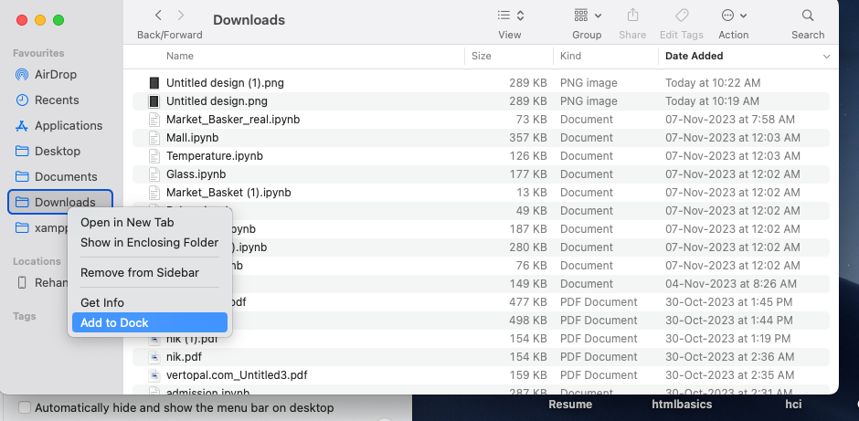
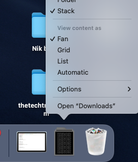

Simply right click on the downloads and select 'Add to Dock'.

When it gets added, one can simply right click on the downloads folder in the deck and customize it as per needs.

### Admonitions

:::tip My tip

You can just drag and drop the downloads to the deck!

:::

